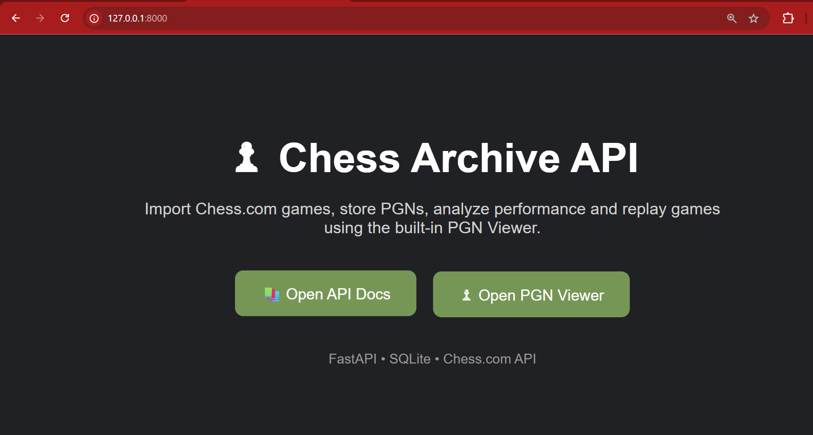
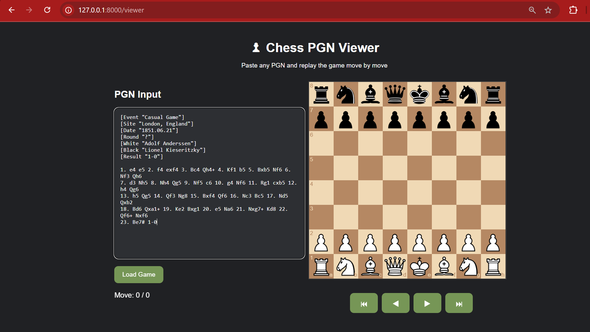
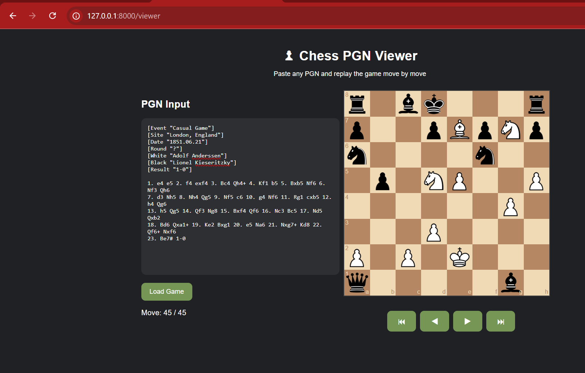
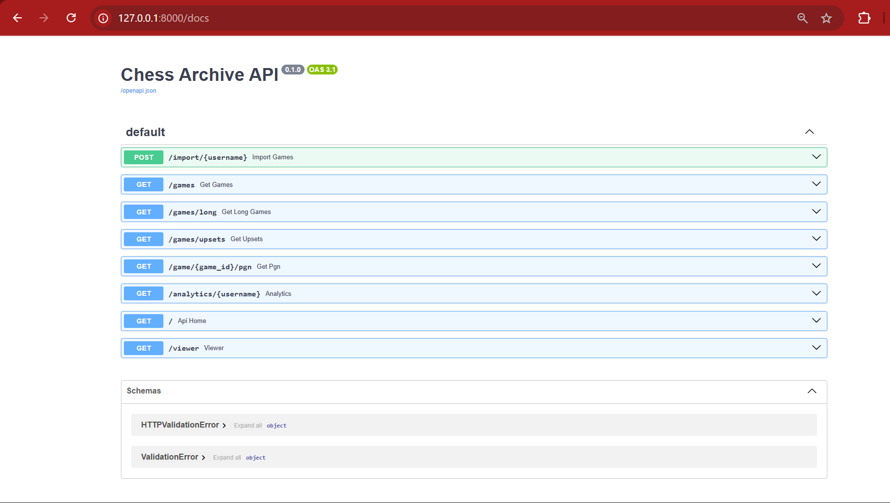
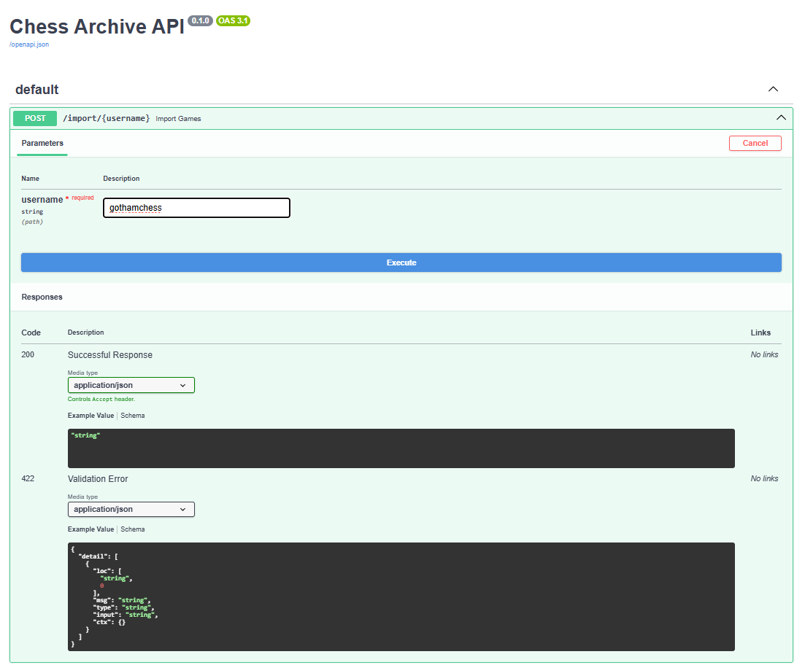
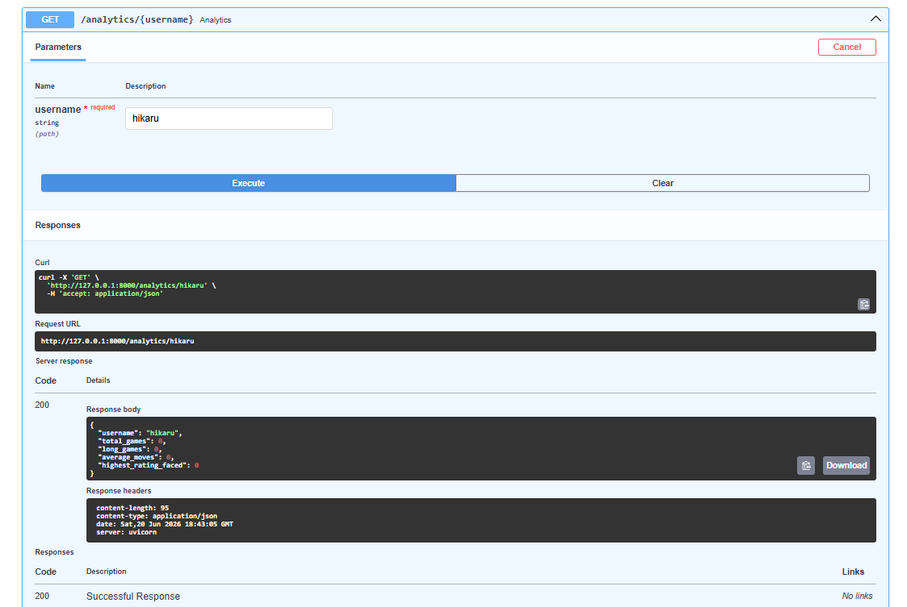
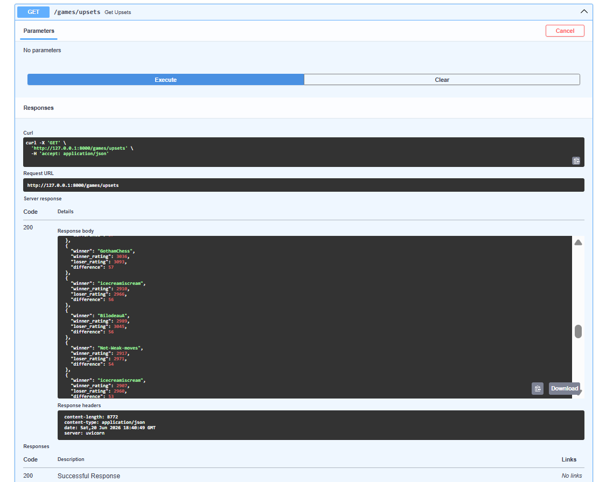

# ♟ Chess Archive API

A FastAPI-powered application that imports games from Chess.com, stores PGNs locally, provides analytics, and allows users to replay games move-by-move in an interactive chess viewer.

---

## ✨ Features

- Import games directly from Chess.com
- Store PGNs in a local SQLite database
- View all imported games
- Find long games (40+ moves)
- Detect rating upsets
- Generate player analytics
- Replay PGNs on an interactive chess board
- Swagger API documentation included

---

## 📸 Screenshots

### Home Page



### PGN Viewer



### PGN Replay Example



### Swagger Documentation



### Import Games Endpoint



### Analytics Endpoint



### Upset Detection



---

## 🛠 Tech Stack

- Python
- FastAPI
- SQLAlchemy
- SQLite
- Jinja2
- Chess.js
- Chessboard.js

---

## 🚀 Installation

Clone the repository:

```bash
git clone https://github.com/ShantanuPatil11/Chess-Automation.git
cd Chess-Automation
```

Create a virtual environment:

```bash
python -m venv venv
```

Activate it:

```bash
venv\Scripts\activate
```

Install dependencies:

```bash
pip install -r requirements.txt
```

Run the application:

```bash
uvicorn app.main:app --reload
```

---

## 🌐 Available Pages

### API Documentation

```
http://127.0.0.1:8000/docs
```

### PGN Viewer

```
http://127.0.0.1:8000/viewer
```

---

## 📊 Available API Endpoints

| Method | Endpoint |
|----------|----------|
| POST | /import/{username} |
| GET | /games |
| GET | /games/long |
| GET | /games/upsets |
| GET | /game/{game_id}/pgn |
| GET | /analytics/{username} |

---

## 🎯 Example Workflow

1. Import games from a Chess.com username
2. Store PGNs locally
3. Analyze player statistics
4. Detect notable upsets
5. Replay games move-by-move in the viewer

---

## 🔮 Future Improvements

- Automated daily game imports with APScheduler
- Email notifications for upset wins
- Opening statistics dashboard
- Player comparison analytics
- Cloud deployment

---

Built with FastAPI ♟️
